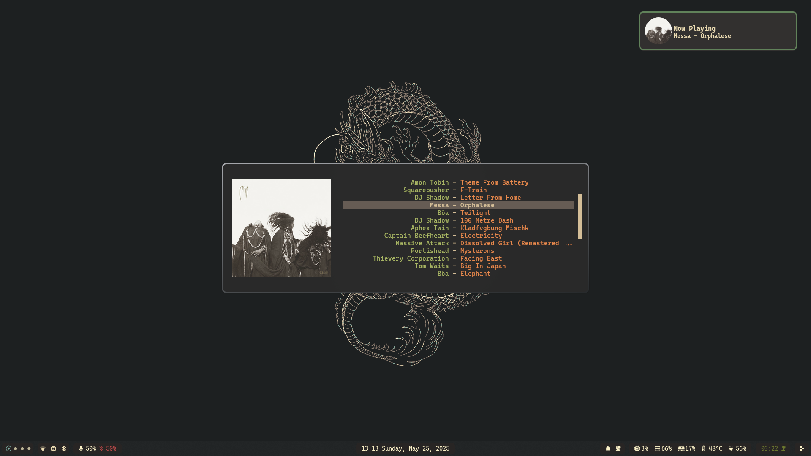

# NixOS // Hyprland Configuration

## Gallery

Environment details

| Type           | Program      |
| :------------- | :----------: |
| Editor         | Neovim |
| Launcher       | Rofi |
| Shell          | Bash |
| Status Bar     | Waybar |
| Terminal       | Kitty |
| Window Manager | Hyprland |
| File Manager   | Nautilus |
| GTK Theme      | Gruvbox Dark |
| GTK Icon Theme | Gruvbox Plus Dark |
| Cursor Theme   | Graphite Dark |
| Terminal Font  | CaskaydiaCove NF |

## Gallery

